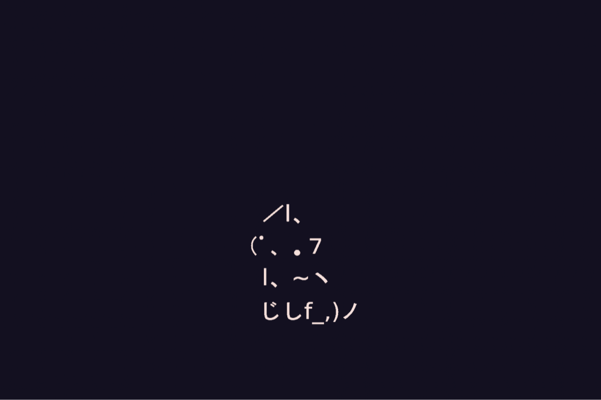

<h1 align="center">
  
   📱 Mail222's Workshop 
</h1>

  <strong>UNOFFICIAL Tweak Repository for AltStore/SideStore</strong> 
  <em>Any/All of my compiled tweaks all in one place</em>

  <!-- AltStore Badge -->
  
  <!-- SideStore Badge -->
  
  <!-- Copy URL Badge -->
  

## 📦 Latest Releases

| App | Version | Build | Updated | Status |
|-----|---------|-------|---------|--------|
| [YouTube Plus (YTLite)](https://github.com/dayanch96/YTLite) | 20.21.6 | 5.2b1 | May 28, 2025 | ✅ |

## 🏁 Emoji Guide

| Emoji | Meaning |
|-------|---------|
| ✅    | App is working and updated |
| ⚠️    | App has known issues or limitations |
| ❌    | App is currently broken or deprecated |
| 🚧    | Update in progress |
| 🔒    | Special requirements needed (explained) |

## 📺 YouTube Plus (YTLite) Details

- **Source**: decrypt.day, [dayanch96/YTLite](https://github.com/dayanch96/YTLite)
- **Last Updated**: May 28, 2025 (App), Mar 29, 2025 (tweak) 
- **Features**: 
  - Built from YTLite project
  - Return YouTube Dislikes **disabled** in this build
## Important Notice:
This repository hosts modified versions of proprietary software. All original applications remain property of their respective copyright holders.

IPAs are provided for educational purposes only

Distribution complies with DMCA Section 1201(f) for reverse engineering research

Remove files within 24 hours upon copyright holder request

No commercial use allowed

⚠️ No warranties provided - use at your own risk

❌ No commercial use allowed

### Redistribution prohibited without explicit permission
- Redistribution of IPA files from this repository is not allowed without explicit permission. I tweak and update them centrally with my own tweaks, while respecting and **crediting original creators**.
- Downloading IPA files from unverified/unexplained sources may expose you to reposted content that has been altered or stripped of proper credit.
- Users are strongly encouraged to verify sources and support the original creators to ensure the continued availability and safety of these files.
